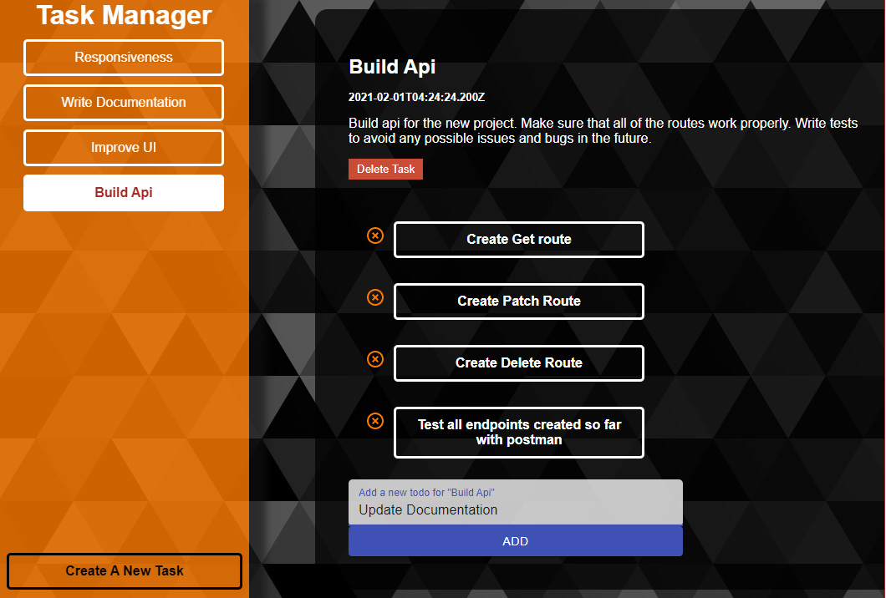

# Task Manager

  

## About

#### This is an application where users can create new tasks in order to organise things that they have to do. Each task has a title and a description. After creating a task the user can add multiple sub-tasks in each task. The user can also edit and delete tasks and sub-tasks.

#### The frontend of this application was created mainly with React and for the layout and styling I used Css and the Material-UI library. I also used Redux for the state managment. The back end is build on Node.js and Express.js. The database used to store all of the data is MongoDB

## Stack

- #### CSS
- #### MaterialUI
- #### React.js
- #### Redux
- #### Node.js
- #### Express.js
- #### MongoDB

## To be implemented

#### This is an early stage of the application. Soon I will add authentication. I also plan on adding some user customisation so the users can change the theme color of the website.
